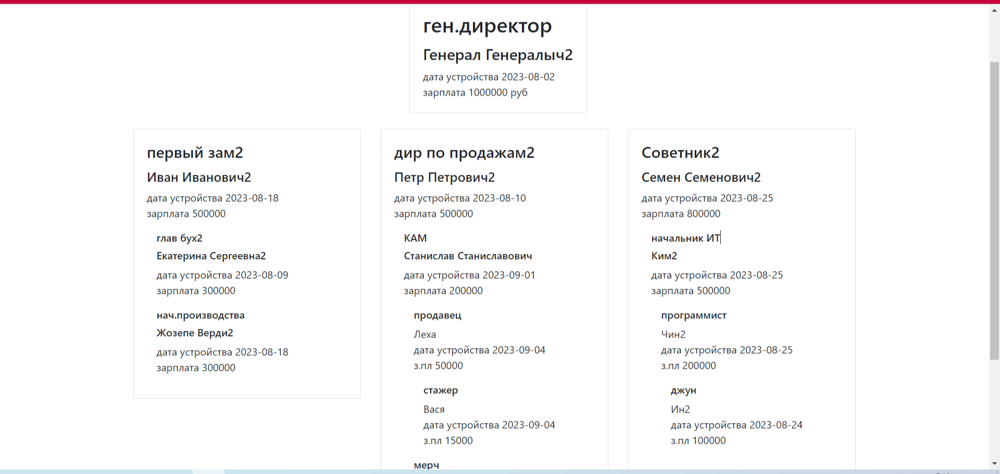

# Тестовое задание для стажера. 
Создайте веб страницу, которая будет выводить иерархию сотрудников в
древовидной форме.

● Информация о каждом сотруднике должна храниться в базе данных и
содержать следующие данные:
- ФИО;
- Должность;
- Дата приема на работу;
- Размер заработной платы;

● У каждого сотрудника есть 1 начальник;

● База данных должна содержать не менее 50 000 сотрудников и 5 уровней
иерархий.

● Не забудьте отобразить должность сотрудника.

## Результат:



## Запуск:

Скачайте код:
```pycon
git clone https://github.com/MaksAnikeev/staffing
```

Перейдите в каталог проекта:
```pycon
cd staffing
```

[Установите Python](https://www.python.org/), если этого ещё не сделали.

Проверьте, что `python` установлен и корректно настроен. Запустите его в командной строке:
```pycon
python --version
```
**Важно!** Версия Python должна быть не ниже 3.6.

Возможно, вместо команды `python` здесь и в остальных инструкциях этого README придётся использовать `python3`. Зависит это от операционной системы и от того, установлен ли у вас Python старой второй версии.

В каталоге проекта создайте виртуальное окружение:
```pycon
python -m venv venv
```
Активируйте его. На разных операционных системах это делается разными командами:

- Windows: `.\venv\Scripts\activate`
- MacOS/Linux: `source venv/bin/activate`


Установите зависимости в виртуальное окружение:
```pycon
pip install -r requirements.txt
```

Определите переменную окружения `SECRET_KEY`. Создать файл `.env` в каталоге `short_links/` и положите туда такой код:
```pycon
SECRET_KEY=django-.......
```

Если вы запускаете проект не на локальном компьютере, а на арендованном сервере,
то необходимо прописать в файле `.env` ip сервера
```pycon
ALLOWED_HOSTS=80.249....
```

Если вы закончили с отладкой и переходите в "боевой" режим, то укажите
в файле `.env`:
```pycon
DEBUG=False
```

Отмигрируйте базу данных на своем компьютере функцией:

```pycon
python manage.py migrate
```

Запустите сервер:

```pycon
python manage.py runserver
```

Заполните админку и ваша штатная структура будет доступна на сайте http://127.0.0.1:8000/
## Цели проекта

Код написан в учебных целях — это урок в курсе по Python и веб-разработке на сайте [Devman](https://dvmn.org).
